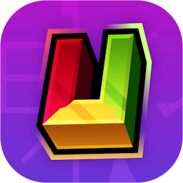

<h1 align="left">
&nbsp;&nbsp;UnityTranslate
</h1>

[Modrinth](https://modrinth.com/mod/unitytranslate) · [CurseForge](https://curseforge.com/minecraft/mc-mods/unitytranslate) · [Discord](https://discord.gg/ECGejX4WFA) · [Support the Developer!](https://ko-fi.com/bluspring)

A Minecraft mod and application designed for free live voice translation, inspired by the QSMP.

Created primarily for the [Unity Multiplayer](https://twitter.com/UnityUpdatesEN) server, and released publicly for the multilingual Minecraft community.

### Installation (Mod)
Official releases of UnityTranslate can be downloaded from the official [Modrinth](https://modrinth.com/mod/unitytranslate) and [CurseForge](https://curseforge.com/minecraft/mc-mods/unitytranslate) pages. 
For communicating with your multilingual friends, the [Simple Voice Chat](https://modrinth.com/plugin/simple-voice-chat) mod is recommended to be installed alongside UnityTranslate.

### Installation (Application)
TODO

### Credits & Acknowledgements
Thank you to [Argos Open Tech](https://www.argosopentech.com/) for developing [Argos Translate](https://github.com/argosopentech/argos-translate). 
Without Argos Translate, this project would have been made significantly more expensive, and the translation system would
have been impossible to develop for free.

An additional thank you to [CADIndie](https://github.com/CADIndie) for developing the Whisper4J library, as it provides
significantly improved transcriptions for us while being fully local.

### License
UnityTranslate is licensed under the [Artistic License 2.0](LICENSE), with a few additional terms: 
- Do not publicly release builds of UnityTranslate on platforms or versions that UnityTranslate is already released on.
  If UnityTranslate is not available for a newly released Minecraft version, you are not permitted to release your own
  build of UnityTranslate for said version unless you have been given explicit permission by the original mod author (BluSpring) to do so.
    
  For instance, provided you utilize a different name and attribute back to the source repository, you may release:
  - A modified build of UnityTranslate built for Minecraft 1.12.2.
  - A modified build of UnityTranslate built for Hytale.
  - A modified build of UnityTranslate built for Minecraft 26w14a.
  - A modified build of UnityTranslate built for Minecraft 26.2 Snapshot 3.
  - A modified build of UnityTranslate Standalone built for PowerPC systems.
   
  
  Consequently, you will not be able to release:
  - A modified build of UnityTranslate built for Minecraft 1.21.1.
  - A separated software built on top of UnityTranslate.

   
  If UnityTranslate did not already exist for the platform or version at the time of your modified project's publication, but was then officially released
  after your project's publication, you may continue maintaining your modified project without any repercussions.
    
  For example: If a modified UnityTranslate project named LegacyTranslate is published for Minecraft 1.13.1 on the 4th of June 2026, and UnityTranslate
  releases an official build for Minecraft 1.13.1 on the 12th of July 2027, both LegacyTranslate and UnityTranslate are allowed to continue
  co-existing with each other.

These terms do not apply to UnityTranslate versions prior to v2.0, which is licensed under the MIT license.
